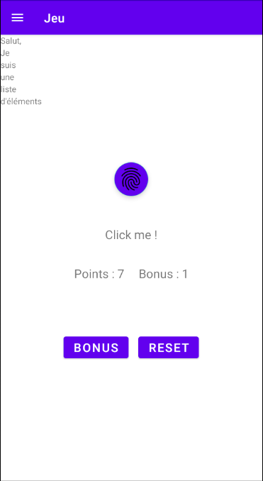
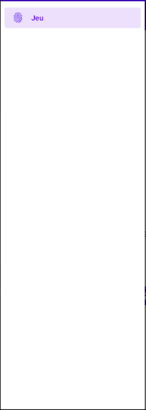
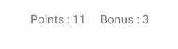
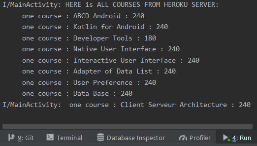
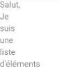

# Documentation AndroidClicker

## Membres du groupes

Ethan ZERAH, Enzo Lemarchand,

## Explications

Comme le nom l'indique, le principe de cette application est d'atteindre le plus grand nombre possible de clic sur le bouton. En appuyant sur le bouton bonus, au prix de 50 points, nous gagnons un bonus qui nous permet d'obtenir des points plus vite.
Le bouton reset sert à remettre les points à 0 et le bonus à 1

Voici le visuel final  

## Constraint Layout

Le constraint layout est dans le content_main.xml et permet l'affichage des éléments de l'application.

## Menu

Le menu est de type drawer, il est présent mais il ne sert à rien.

## Persistance des données

Elle est sur le nombre de points et le niveau du bonus.

## Communication HTTPS

Import de titres et de longueur de cours du serveur heroku. Ils sont affichés dans la console.

## Liste d'éléments 

Affichage de mots présents dans le string.xml.

